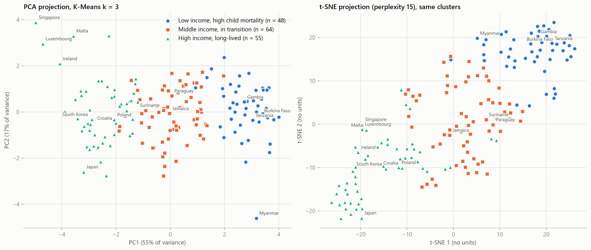

# Track J1 — Supervised & Unsupervised Learning

Two notebooks, two datasets, one question each:

| Part | Notebook | Dataset | Question |
|---|---|---|---|
| A. Supervised | [notebooks/01_supervised_fraud.ipynb](notebooks/01_supervised_fraud.ipynb) | PaySim mobile-money transactions (6.36M rows, label `isFraud`) | Does a tuned tree ensemble (XGBoost) beat a naive baseline and a simpler model at detecting fraud? |
| B. Unsupervised | [notebooks/02_unsupervised_countries.ipynb](notebooks/02_unsupervised_countries.ipynb) | `Country-data.csv` (167 countries × 9 indicators, no labels) | Which groups of countries exist, how many, and what do they mean? |

Both notebooks are saved **with their outputs**, so every table and figure can be read without re-running anything.

---

## Results at a glance

### A. Fraud detection (test set: 415,562 transactions, 1,232 frauds)

Only `TRANSFER` and `CASH_OUT` transactions can be fraudulent in this data, so the model is built on those (2.77M rows, 0.30% fraud). Accuracy is useless at this imbalance (a model that never flags fraud is 99.70% accurate), so the headline metric is **PR-AUC**; precision, recall and F1 use a threshold chosen on a separate validation set.

| Model | PR-AUC | ROC-AUC | Precision | Recall | F1 | Missed frauds | False alarms |
|---|---|---|---|---|---|---|---|
| Naive (always "not fraud") | 0.0030 | 0.500 | 0.000 | 0.000 | 0.000 | 1,232 | 0 |
| Rule (`isFlaggedFraud`) | 0.0062 | 0.502 | 1.000 | 0.003 | 0.006 | 1,228 | 0 |
| Logistic regression | 0.9697 | 0.9985 | 0.906 | 0.973 | 0.939 | 33 | 124 |
| **XGBoost (tuned)** | **0.9972** | **0.9990** | **1.000** | **0.997** | **0.998** | **4** | **0** |

Ablation (does the model or the features do the work?), PR-AUC on the test set:

| | raw features | raw + engineered balance features |
|---|---|---|
| Logistic regression | 0.5495 | 0.9697 |
| XGBoost | 0.9289 | 0.9972 |

- XGBoost beats the naive baseline by a wide margin and also beats logistic regression. The gap is large on raw features and smaller, but consistent, once balance-consistency features are engineered. The PR-AUC advantage over logistic regression is +0.0275 (95% bootstrap interval +0.0215 to +0.0340; XGBoost was higher in all 1,000 resamples).
- The ordering of the models is the reliable result. The near-perfect absolute scores are partly a property of the synthetic data (see the limitations in the notebook).

### B. Country clusters (K-Means, k = 3)

k was chosen by a rule written down before the metrics were computed: highest mean **silhouette** among k ≥ 3, subject to a minimum cluster size and a stability bar, with elbow / Davies–Bouldin / Calinski–Harabasz / stability reported alongside. k = 2 scores a higher silhouette but is deliberately excluded (stated openly in the notebook) because a two-way split does not give a grouping worth interpreting.

| Cluster | Countries | Median child mortality | Median life expectancy | Median income |
|---|---|---|---|---|
| 1. Low income, high child mortality | 48 | 88.8 | 60.8 | $1,860 |
| 2. Middle income, in transition | 64 | 20.5 | 72.3 | $9,925 |
| 3. High income, long-lived | 55 | 5.5 | 79.8 | $29,600 |

The clusters are best read as low / middle / high tiers along a development continuum: DBSCAN finds one dense region and no density gaps, and the middle cluster is the loosest (most borderline countries). The 2D view uses PCA (PC1 = development axis, 55% of variance; PC1 + PC2 = 71.6%) and t-SNE side by side.



---

## Pass-criteria checklist

| Criterion | Where to find the evidence |
|---|---|
| A notebook with the trained ensemble, its metrics and a comparison table against baselines | Notebook 01 §5–§6; [reports/model_comparison.csv](reports/model_comparison.csv), [reports/ablation.csv](reports/ablation.csv) |
| Ensemble outperforms the naive baseline, or the trainee explains why it doesn't | Notebook 01 §6.1 (table), §6.3 (PR curves), §6.5 (bootstrap), §7.1 (explicit PASS check, computed in code) |
| A 2D visualisation of the clustering with a short interpretation | Notebook 02 §5.2 (PCA + t-SNE), §6.4 (interpretation); [reports/figures/country_clusters_pca_tsne.png](reports/figures/country_clusters_pca_tsne.png) |
| Cluster count/parameters chosen with a stated method, not guessed | Notebook 02 §4.1 (rule, written before the computation), §4.2 (selection computed in code), §4.3 (criteria plot); [reports/kmeans_k_selection.csv](reports/kmeans_k_selection.csv) |
| Steady, spread-out work | Shown by the commit history (`git log`), not by the notebooks |

---

## M2.2 checkpoint: core development of the fraud model

The J1 fraud model is the capstone's core model, and the J1 end state (`d3eae82`) is the M2.1 baseline. The full write-up is [reports/M2.2_progress_report.md](reports/M2.2_progress_report.md).

| Notebook | What it does | Run time |
|---|---|---|
| [03_core_model_iterations.ipynb](notebooks/03_core_model_iterations.ipynb) | Decision rules written first, seed noise floor, then 3 iterations judged on validation | about 30 min |
| [04_raw_feature_convergence.ipynb](notebooks/04_raw_feature_convergence.ipynb) | A convergence problem found in the J1 ablation model, and its fix | about 12 min |
| [05_final_comparison.ipynb](notebooks/05_final_comparison.ipynb) | The one test-set comparison, with a paired bootstrap | about 3 min |

**Result.** The baseline is already at the ceiling (test PR-AUC 0.9972, 4 of 1,232 frauds missed, 0 false alarms), and none of the three iterations moved PR-AUC beyond seed noise (σ = 0.00026). One change, a threshold chosen by expected cost, looked good on validation (cost down 27%, or 13% cross-fitted) but on the test set it caught no extra fraud and cost 58,800 more at 100 units per alert, so it is not adopted. The convergence fix cut the raw-feature model from 1,886 to 733 trees at the same accuracy.

| Iteration | Change | Val PR-AUC | Decision |
|---|---|---|---|
| 0 | Baseline | 0.99718 | reference |
| 1 | Ratio and flag features | 0.99730 | reverted (inside noise) |
| 2 | Cost-based threshold | 0.99718 | kept on validation, not adopted after the test result |
| 3 | Second-stage search on all of train | 0.99712 | reverted |

| Criterion | Where to find the evidence |
|---|---|
| Measurable improvement over the baseline, or a documented reason why not | [Report](reports/M2.2_progress_report.md), notebook 05, [final_comparison.csv](reports/m2_2/final_comparison.csv), [final_bootstrap.csv](reports/m2_2/final_bootstrap.csv) |
| At least 2 distinct iterations recorded | [experiment_log.csv](reports/m2_2/experiment_log.csv), notebook 03 |
| A real problem fixed or documented | Notebook 04, [raw_convergence.csv](reports/m2_2/raw_convergence.csv); the threshold problem in notebook 05 |
| Tests | `python -m pytest -q` (45 fast tests at this checkpoint, 65 with J2); `python -m pytest -m slow` (2 tests against the real data) |
| Incremental commit history and daily work | `git log --format='%h %ad %s' --date=short`, [daily_log.md](reports/m2_2/daily_log.md) |

---

## J2 checkpoint: evaluation and hyper-parameter tuning

The prior models are the fraud classifiers from the earlier tracks (XGBoost and logistic regression, engineered features). Write-up: [reports/j2/J2_report.md](reports/j2/J2_report.md); leakage note: [reports/j2/leakage_note.md](reports/j2/leakage_note.md); notebook: [06_evaluation_and_tuning.ipynb](notebooks/06_evaluation_and_tuning.ipynb) (about 15 min).

| Model | Tuned by | Test PR-AUC, untuned | Test PR-AUC, tuned | Difference real? |
|---|---|---|---|---|
| XGBoost | random search, 40 configurations | 0.9975 | 0.9975 | no (bootstrap interval straddles 0) |
| Logistic regression | grid search, 10 combinations | 0.9921 | 0.9922 | no, only just (interval -0.0000 to +0.0004) |

Tuning did not change how well either model ranks frauds. It did move XGBoost's operating point (7 missed frauds at the validation-chosen threshold, 4 after tuning), and it showed that J1's logistic-regression baseline was handicapped by class weighting, so XGBoost's lead over it is about 0.005, not 0.028. The metrics are PR-AUC (headline), ROC-AUC, and precision, recall and F1 at a validation-chosen threshold, with stratified CV; accuracy is not used because a model that never flags anything is 99.7% accurate.

| Criterion | Where to find the evidence |
|---|---|
| Real grid or random search, tuned against untuned | Notebook 06 sections 3 and 4; [search_results.csv](reports/j2/search_results.csv), [tuned_vs_untuned.csv](reports/j2/tuned_vs_untuned.csv), [bootstrap.csv](reports/j2/bootstrap.csv); code in `fraud/search.py` |
| Metrics that fit the problem, and why | Notebook 06 section 2; "Why these metrics" in [J2_report.md](reports/j2/J2_report.md) |
| Leakage identified and ruled out, written note | [leakage_note.md](reports/j2/leakage_note.md), [leakage_checks.csv](reports/j2/leakage_checks.csv); code in `fraud/leakage.py` |
| Tests | `tests/test_search.py`, `tests/test_leakage.py`, `tests/test_model.py` (`python -m pytest -q`, 65 tests) |

---

## Repository layout

```
data/
  Country-data.csv                          committed (9 KB)
  PS_20174392719_1491204439457_log.csv      NOT committed (470 MB, see below)
fraud/                                      tested code moved out of notebook 01 (data, features, metrics, model, experiments, search, leakage)
tests/                                      pytest tests (synthetic frames; two slow ones use the real data)
notebooks/
  01_supervised_fraud.ipynb
  02_unsupervised_countries.ipynb
  03_core_model_iterations.ipynb            M2.2
  04_raw_feature_convergence.ipynb          M2.2
  05_final_comparison.ipynb                 M2.2
  06_evaluation_and_tuning.ipynb            J2
reports/
  model_comparison.csv  ablation.csv  xgboost_tuning_results.csv
  kmeans_k_selection.csv  country_cluster_profile.csv  country_clusters.csv
  M2.2_progress_report.md
  m2_2/   experiment_log.csv  final_comparison.csv  final_bootstrap.csv  raw_convergence.csv  daily_log.md
  j2/     J2_report.md  leakage_note.md  tuned_vs_untuned.csv  bootstrap.csv  search_results.csv  leakage_checks.csv
  figures/*.png
pytest.ini
requirements.txt
```

## Running it yourself

1. `pip install -r requirements.txt` (developed on Python 3.14; scikit-learn 1.9, XGBoost 3.4, pandas 3.0).
2. Put the PaySim file at `data/PS_20174392719_1491204439457_log.csv`. It is too large for git (GitHub rejects files over 100 MB, so it is listed in `.gitignore`); download it from Kaggle: <https://www.kaggle.com/datasets/ealaxi/paysim1>. `Country-data.csv` is already in the repository.
3. Execute the notebooks (from the project root):

   ```
   python -m nbconvert --to notebook --execute --inplace notebooks/02_unsupervised_countries.ipynb
   python -m nbconvert --to notebook --execute --inplace notebooks/01_supervised_fraud.ipynb
   ```

   Notebook 02 takes under a minute. Notebook 01 takes roughly 13–17 minutes on an 8-core machine (the hyper-parameter search is ~6–10 minutes and the raw-feature ablation fit ~4–5 minutes); peak memory is a few GB.

4. For the M2.2 work, run the tests and the three newer notebooks the same way:

   ```
   python -m pytest -q
   python -m pytest -m slow
   python -m nbconvert --to notebook --execute --inplace notebooks/03_core_model_iterations.ipynb
   python -m nbconvert --to notebook --execute --inplace notebooks/04_raw_feature_convergence.ipynb
   python -m nbconvert --to notebook --execute --inplace notebooks/05_final_comparison.ipynb
   ```

   Run 03 before 05: notebook 05 reads the kept iteration from `reports/m2_2/experiment_log.csv`.

   The J2 notebook is independent of the others:

   ```
   python -m nbconvert --to notebook --execute --inplace notebooks/06_evaluation_and_tuning.ipynb
   ```

All random seeds are fixed (`random_state = 42`), so the numbers above reproduce.

## Notes

- Notebook 01 splits the data **stratified at random**, not chronologically, because PaySim's legitimate traffic collapses on several days while fraud stays constant, which makes the fraud rate an artefact of the calendar. A chronological hold-out is reported as a robustness check (§6.6) and gives the same model ordering. `step` is not used as a feature for the same reason.
- Identifier columns (`nameOrig`, `nameDest`) and the simulator's own `isFlaggedFraud` output are not model inputs; `isFlaggedFraud` is used only as a rule-based baseline.
